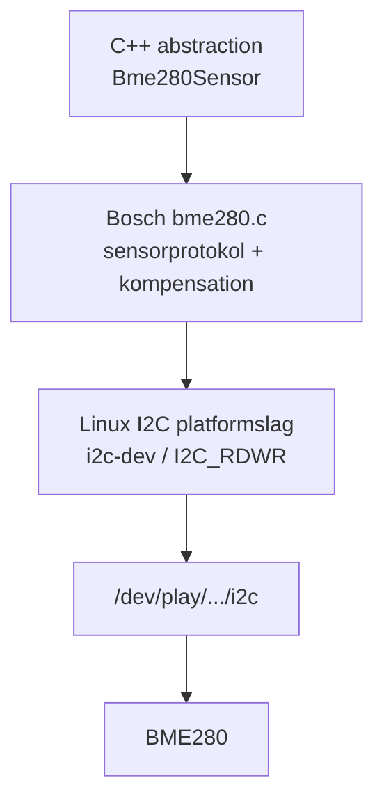
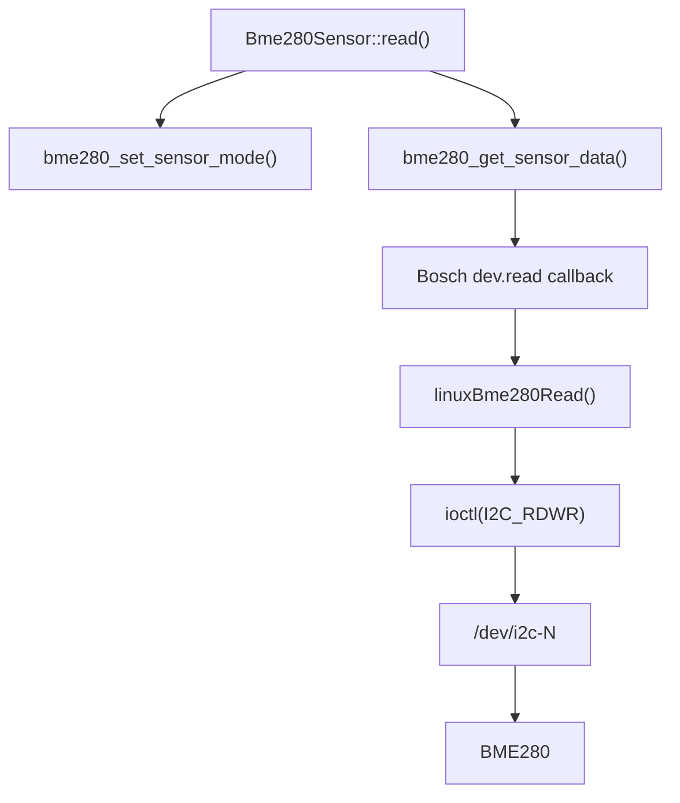

# Fra Bosch C-driver til den udleverede C++-wrapper

Denne tekst forklarer, **hvad der ligger under `Bme280Sensor`**, og hvordan I
selv kunne bygge samme type integration.

Den er ikke nødvendig for at anvende wrapperen, men den er en del af den
tekniske forståelse af løsningen.

## Indholdsfortegnelse

1. [Tre softwarelag](#1-tre-softwarelag)
2. [Boschs callback-model](#2-boschs-callback-model)
3. [Linux erstatter Boschs platformseksempel](#3-linux-erstatter-boschs-platformseksempel)
4. [C-driveren pakkes ind i C++](#4-c-driveren-pakkes-ind-i-c)

---

## 1. Tre softwarelag

Der er tre forskellige problemer, som ikke bør blandes sammen:



**Bosch-laget** ved, hvordan BME280 fungerer.

**Linux-laget** ved, hvordan BeaglePlay sender og modtager I2C-transaktioner.

**C++-laget** giver resten af applikationen et enkelt interface.

Officielle kilder:

- Bosch SensorAPI: https://github.com/boschsensortec/BME280_SensorAPI
- Bosch BME280 datablad:
  https://www.bosch-sensortec.com/media/boschsensortec/downloads/datasheets/bst-bme280-ds002.pdf
- Linux I2C userspace:
  https://docs.kernel.org/i2c/dev-interface.html

---

## 2. Boschs callback-model

Åbn Boschs:

```text
bme280.h
bme280_defs.h
bme280.c
examples/common/
```

I `struct bme280_dev` findes blandt andet:

```text
read
write
delay_us
intf_ptr
```

Bosch-driveren gør derfor konceptuelt:

```text
"læs register"
      ↓
dev->read(...)
      ↓
en funktion som platformen leverer
```

Bosch kan dermed bruge samme `bme280.c` på mange platforme.

Se især:

https://github.com/boschsensortec/BME280_SensorAPI/tree/master/examples/common

Boschs eksempel bruger deres eget platformslag. Pointen er ikke navnet på
platformen, men mønsteret:

```text
Bosch sensor-driver
        ↓ callback
platform-specifik I2C
```

Den udleverede wrapper bruger præcis samme mønster.

---

## 3. Linux erstatter Boschs platformseksempel

På BeaglePlay har vi ikke Arduino `Wire` og vi bruger heller ikke Boschs
development-board API.

Vi har Linux:

```text
/dev/play/grove/i2c
```

eller:

```text
/dev/play/qwiic/i2c
```

De stabile navne ender ved et almindeligt Linux `/dev/i2c-N` device.

I den udleverede kode ligger Linux-platformslaget i:

```text
include/linux_i2c.hpp
src/linux_i2c.cpp
```

Find funktionerne:

```text
linuxBme280Read(...)
linuxBme280Write(...)
linuxBme280DelayUs(...)
```

De har de funktionssignaturer, Bosch forventer.

### Hvorfor `I2C_RDWR`?

Linux har flere userspace-måder at arbejde med I2C på.

Wrapperen bruger `I2C_RDWR`, så en registerlæsning kan laves som en kombineret
transaktion:

```text
START
→ adresse + WRITE
→ registeradresse
→ REPEATED START
→ adresse + READ
→ data
→ STOP
```

Det svarer til den type registeradgang Bosch-driveren har brug for.

Læs den officielle Linux-dokumentation:

https://docs.kernel.org/i2c/dev-interface.html

I `src/bme280_sensor.cpp` forbindes de to verdener:

```text
dev.read     = linuxBme280Read
dev.write    = linuxBme280Write
dev.delay_us = linuxBme280DelayUs
dev.intf_ptr = Linux I2C context
```

Derefter kan Bosch kalde Linux-koden uden selv at kende Linux.

---

## 4. C-driveren pakkes ind i C++

Boschs driver forbliver C:

```text
vendor/bosch/bme280.c
```

Den skal ikke omskrives til C++.

Boschs header har C++-guard, så API'et kan inkluderes fra C++.

Den udleverede `Bme280Sensor` gør resten af applikationen enklere.

I stedet for at `main()` skal kende:

```text
bme280_dev
callback-funktioner
file descriptor
measurement delay
sensor mode
Bosch error codes
```

kan applikationen arbejde med:

```cpp
Bme280Sensor sensor(device, address);
sensor.init();
auto value = sensor.read();
```

Dette er en **abstraction**. Det komplekse er stadig til stede, men ansvaret er
flyttet ud af applikationslogikken.

### Følg et `read()` gennem koden

Start i:

```text
Bme280Sensor::read()
```

og følg derefter:



Det er en god måde at læse fremmed source-kode på: start ved det interface,
jeres eget program bruger, og følg kaldskæden nedad.

### Hvis I vil bygge det selv

En mulig progression er:

1. Få `i2cget` til at læse chip-ID `0xD0`.
2. Skriv et lille C/C++-program der selv læser samme register gennem Linux.
3. Generalisér det til en Bosch-kompatibel `read` callback.
4. Implementér tilsvarende `write` og `delay`.
5. Udfyld `struct bme280_dev`.
6. Kald `bme280_init()`.
7. Konfigurér sensorens oversampling/mode.
8. Kald `bme280_get_sensor_data(BME280_ALL, ...)`.
9. Refaktorér den fungerende integration til en C++ abstraction.
10. Integrér abstractionen i Sensor Publisher.

På den måde opstår en fil som `bme280_sensor.cpp` som resultat af
**integration + refaktorering**, ikke som magi.
