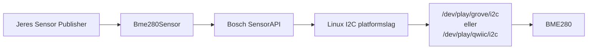

# 17683 – BME280 C++ wrapper til BeaglePlay

**Elevpakke – version 1.0**

Denne pakke giver jer et lille C++-interface til en BME280 på BeaglePlay.

Formålet er **ikke** at skjule Linux eller I2C. I skal stadig selv kunne finde
bussen, identificere sensoren og forstå datavejen. Pakken fjerner derimod
kravet om, at alle grupper selv skal porte Boschs C-driver til Linux, før de
kan begynde på selve Sensor Publisher.

## Indholdsfortegnelse

1. [Hvad får I udleveret?](#1-hvad-får-i-udleveret)
2. [Før I bruger wrapperen](#2-før-i-bruger-wrapperen)
3. [Byg og test](#3-byg-og-test)
4. [Brug wrapperen i Sensor Publisher](#4-brug-wrapperen-i-sensor-publisher)
5. [Hvad skal I selv kunne?](#5-hvad-skal-i-selv-kunne)

---

## 1. Hvad får I udleveret?

Det interface, jeres program skal bruge, ligger i:

```text
include/bme280_sensor.hpp
```

Den komplicerede del ligger stadig som læsbar source-kode:

```text
src/bme280_sensor.cpp
src/linux_i2c.cpp
include/linux_i2c.hpp
```

Boschs officielle driver hentes separat:

```text
vendor/bosch/
```

Den samlede kæde er:



I standardopgaven **bruger** I wrapperen. I behøver ikke skrive den igen.

Læs også:

- [`docs/Fra_Bosch_C_til_CPP.md`](docs/Fra_Bosch_C_til_CPP.md)
- [`docs/Maalepinde_og_afgraensning.md`](docs/Maalepinde_og_afgraensning.md)

---

## 2. Før I bruger wrapperen

I skal først selv undersøge hardwaren fra Linux.

Installer værktøjerne:

```bash
sudo apt update
sudo apt install -y build-essential curl i2c-tools
```

Find jeres connector:

```bash
readlink -f /dev/play/grove/i2c
```

eller:

```bash
readlink -f /dev/play/qwiic/i2c
```

Find busnummeret og scan den relevante bus:

```bash
i2cdetect -l
sudo i2cdetect -r -y <busnummer>
```

En BME280 svarer typisk på `0x76` eller `0x77`.

Verificér den konkrete chip ved at læse chip-ID register `0xD0`:

```bash
sudo i2cget -y <busnummer> 0x76 0xD0
```

En BME280 skal give:

```text
0x60
```

Hvis I bruger adresse `0x77`, tilpasses kommandoen.

### Rettigheder

Jeres færdige applikation bør ikke være afhængig af at køre som root.

Undersøg først device-rettighederne:

```bash
ls -l "$(readlink -f /dev/play/grove/i2c)"
groups
```

Hvis device-filen tilhører gruppen `i2c`, men jeres bruger ikke gør, kan
brugeren typisk tilføjes til gruppen med:

```bash
sudo usermod -aG i2c "$USER"
```

Log helt ud og ind igen bagefter, og kontrollér med:

```bash
groups
```

Brug `sudo` til diagnose hvis nødvendigt, men løs permanente
rettighedsproblemer med passende bruger-/grupperettigheder.

---

## 3. Byg og test

Hent først Boschs officielle BME280 SensorAPI:

```bash
chmod +x scripts/fetch_bosch.sh
./scripts/fetch_bosch.sh
```

Pakken er lavet mod **Bosch BME280 SensorAPI v3.5.1**. Bosch-repositoryets Git-ref for denne version hedder `bme280_v3.5.1`.

Byg demoen:

```bash
make
```

Test Grove, eksempelvis på adresse `0x76`:

```bash
./build/bme280-demo /dev/play/grove/i2c 0x76
```

eller Qwiic:

```bash
./build/bme280-demo /dev/play/qwiic/i2c 0x76
```

Eksempel på output:

```text
temperature_c=22.41
humidity_pct=47.82
pressure_hpa=1012.36
```

Hvis wrapperen virker, har I bevist denne kæde:

```text
C++ demo
→ Bme280Sensor
→ Bosch SensorAPI
→ Linux I2C
→ fysisk BME280
```

Demoen er **ikke Sensor Publisher**. Den publicerer ikke MQTT og laver ikke
jeres færdige applikationslogik.

---

## 4. Brug wrapperen i Sensor Publisher

Det elevvendte interface er bevidst lille:

```cpp
#include "bme280_sensor.hpp"

Bme280Sensor sensor("/dev/play/grove/i2c", 0x76);

sensor.init();

auto measurement = sensor.read();

measurement.temperature_c;
measurement.humidity_pct;
measurement.pressure_hpa;
```

I jeres endelige løsning må device-path og adresse ikke være hardcoded som i
det lille eksempel ovenfor. De skal komme fra jeres egen konfiguration.

### Jeres Makefile

I skal selv integrere de udleverede source-filer i jeres eget Makefile.

Følgende dele skal bygges:

```text
jeres egne .cpp-filer
src/bme280_sensor.cpp
src/linux_i2c.cpp
vendor/bosch/bme280.c
```

Bemærk:

```text
.cpp  → C++
.c    → C
```

Boschs `bme280.c` kan bygges som C og linkes sammen med jeres C++ object-filer.

I kan læse pakkens `Makefile` som et **eksempel på mekanikken**, men I skal
selv sørge for, at jeres Sensor Publisher-projekt bliver bygget korrekt.

### MQTT-koden skal genbruges

MQTT publisher-funktionaliteten har I allerede arbejdet med i forbindelse med
Telemetry Processor.

Den skal genbruges gennem separate source/header-filer. Den samme
MQTT-implementation må ikke bare copy/pastes ind i Sensor Publisher.

Jeres program skal selv kombinere:

```text
Bme280Sensor
      +
configuration
      +
JSON
      +
jeres eksisterende C++ MQTT publisher
      +
programflow og fejlhåndtering
```

Raw telemetry skal publiceres til:

```text
sensors/bp-XX/raw
```

---

## 5. Hvad skal I selv kunne?

Selv om sensor-wrapperen er udleveret, skal I kunne demonstrere og forklare:

- hvordan Grove/Qwiic forbindes til Linux I2C,
- hvilket stabilt `/dev/play/...` alias I anvender,
- hvilket underliggende `/dev/i2c-N` det peger på,
- hvordan I fandt sensorens I2C-adresse,
- hvordan I verificerede chip-ID `0x60`,
- at wrapperen bruger Boschs officielle BME280 SensorAPI,
- at Bosch-driveren kalder et platformslag gennem callbacks,
- at platformslaget kommunikerer med Linux `i2c-dev`,
- hvordan `.c` og `.cpp` bygges og linkes i samme projekt,
- hvordan jeres egen Sensor Publisher bruger wrapperen,
- hvordan I genbruger MQTT publisher-kode,
- hvordan raw sensor-data sendes videre gennem jeres IoT-system.

I skal **selv udvikle**:

```text
Sensor Publisher application
configuration
JSON
MQTT-integration
programflow
fejlhåndtering
jeres eget Makefile/projektintegration
```

### Ekstra niveau

Hvis I er hurtigt færdige eller ønsker større embedded Linux-dybde:

> Implementér jeres egen erstatning for den udleverede BME280-wrapper ved at
> bruge Boschs SensorAPI og Linux' `i2c-dev` dokumentation.

Start i:

- Bosch `examples/common`
- Bosch `examples/humidity`, `pressure` eller `temperature`
- Linux kernel-dokumentationen for I2C userspace

Se den detaljerede vejledning i:

[`docs/Fra_Bosch_C_til_CPP.md`](docs/Fra_Bosch_C_til_CPP.md)
